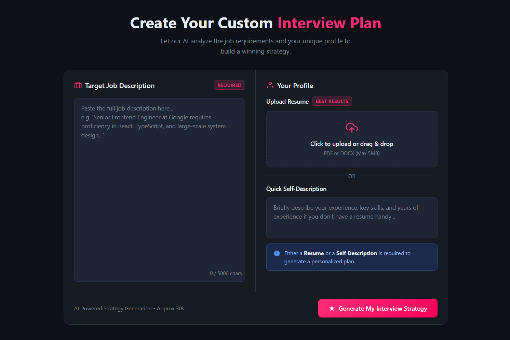
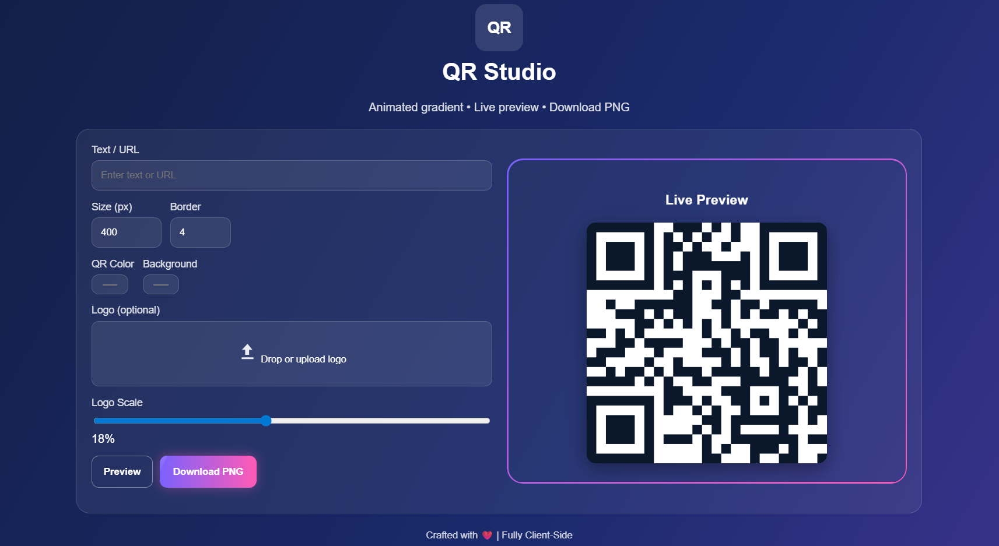
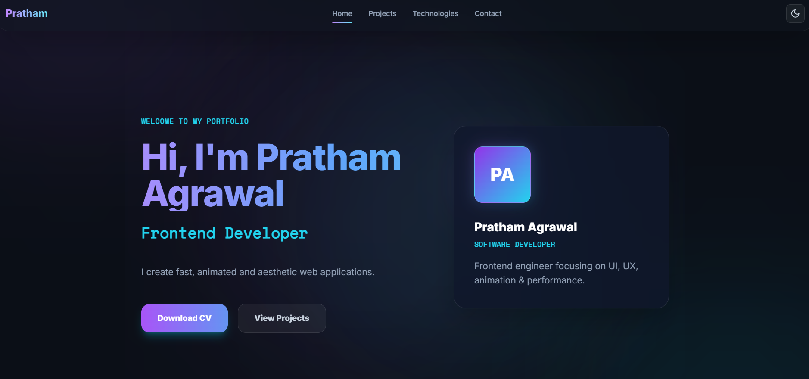

  

---

# 👋 About Me

- 🎓 B.Tech CSE (AI & Data Science)
- 💼 Frontend Developer Intern @ Uptoskills
- 📊 Microsoft Elevate Intern (Power BI)
- 🤖 Interested in AI, Full Stack Development & Data Analytics
- 🚀 Building production-ready applications

---

# ⚡ Tech Arsenal

<table align="center">
<tr>
<td align="center" width="120">

 React

</td>

<td align="center" width="120">

 Node.js

</td>

<td align="center" width="120">

 Express

</td>

<td align="center" width="120">

 MongoDB

</td>

<td align="center" width="120">

 PostgreSQL

</td>
</tr>

<tr>
<td align="center">

 Python

</td>

<td align="center">

 Java

</td>

<td align="center">

 C++

</td>

<td align="center">

 Tailwind

</td>

<td align="center">

 Figma

</td>
</tr>
</table>

---

# 🚀 Featured Projects

## 🤖 AI-Powered Custom Interview Planner

AI platform that generates interview roadmaps, ATS resumes, skill-gap analysis and question banks using Google Gemini.

**Stack:** React • Node.js • Express • MongoDB • Gemini AI • JWT • Puppeteer

🌐 Live: https://ai-interview-planner-agent.vercel.app/

📂 Repo: https://github.com/PrathamAgrawal525/GENAI_Project

---

## 🎨 QR Studio

Premium QR generator with logo embedding, live preview, customization and PNG export.

**Features**
- Live generation
- Logo overlay
- Canvas rendering
- Error Correction H
- Glassmorphism UI

**Stack:** HTML • CSS • JavaScript • QRious

🌐 Live: https://qr-generator-universal.vercel.app/

📂 Repo: https://github.com/PrathamAgrawal525/QR_Generator

---

## 🌐 Developer Portfolio

Modern portfolio built using React + Tailwind CSS.

🌐 Live: https://PrathamAgrawal525.github.io

📂 Repo: https://github.com/PrathamAgrawal525/PrathamAgrawal525.github.io

---

# 📈 GitHub Analytics

---

# 🎯 Current Focus

- Full Stack Development
- AI Applications
- System Design
- Backend Engineering
- PostgreSQL
- Performance Optimization

---

# 📬 Connect

---

> ⭐ Code with purpose. Build with passion. Keep learning.

